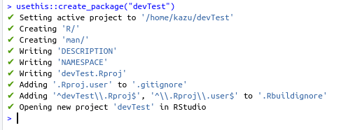
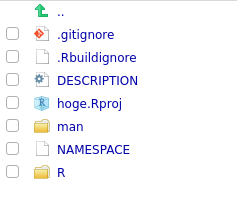
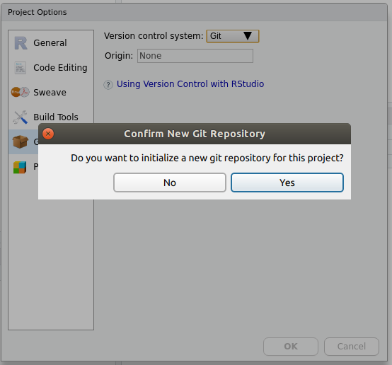
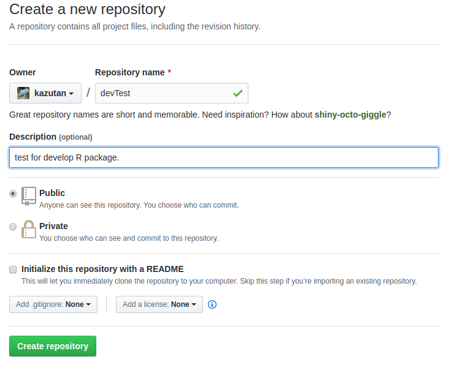
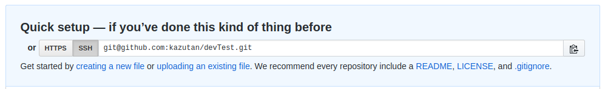
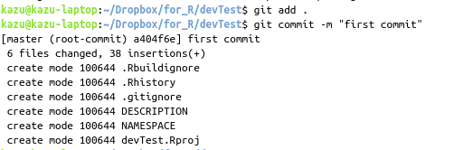
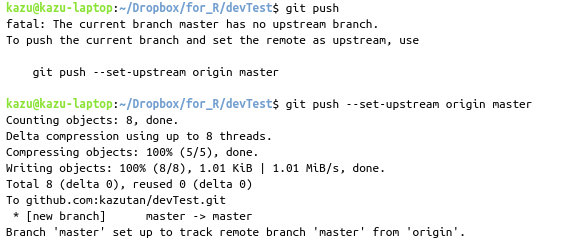

# repositoryとproject

```{r 02_setup, include=FALSE}
knitr::opts_chunk$set(eval = FALSE,
                      echo = TRUE,
                      comment = "#> ",
                      collapse = TRUE,
                      warning = FALSE,
                      message = FALSE)
library(tidyverse)
```


## repository、projectとは

repository(リポジトリ、レポジトリ)は、雑に言うとコードや画像などのファイルを束ねているものです。

https://ja.wikipedia.org/wiki/%E3%83%AA%E3%83%9D%E3%82%B8%E3%83%88%E3%83%AA

アプリケーションに必要なものは一つにまとめてしまったほうが開発･運用･利用が便利ですよね。

project(ここでは一般的な意味ではなくRStudio上のprojectとします)は、(すごく雑に言うと)R上でのrepositoryに(ほぼ)相当します。RStudioでプロジェクトを準備すると…

- 実際のタスク単位でファイルをまとめていける
- そのプロジェクトで色々設定することができる
    - working directoryをプロジェクトで固定できる
    - Rのoptionsをプロジェクト単位で設定できる
    - history, buildとか管理できる
    - 他にもいろいろ便利

なので、RStudioを使うなら基本的にprojectを作ってそこで作業しましょう。

今回はパッケージ開発のお話なので、それを前提としたprojectおよびrepositoryを準備していきます。

## projectの準備

まずは、作るパッケージ名を考えましょう。Rのパッケージ名は[a-zA-Z0-9]で考えてください。ここでは`devTest`とします。

RStudioでは、パッケージ開発用にprojectを新規で準備することができます…が、今ではもっと簡単に準備できます。以下の一行でOKです:

```{r}
usethis::create_package("path_to_project")
```

引数には、自分がプロジェクトを設置したいパスを指定してください。すると以下のようになります:



すると、**自動的にパッケージ開発に必要なファイルが準備**されます:



次に、このプロジェクトにgitをあてるように準備します。メニューの[Tools] - [Project Option...]へ進み、gitを有効化(初期化)します:



これでprojectの準備は(ひとまず)完了です。

## repositoryの準備

パッケージを設置するリポジトリを準備します。GitHubにアクセスしてログインし、repositoryを新規作成します。



リポジトリ名はさっき考えたプロジェクト名(パッケージ名)がいいでしょう。ポイントは**READMEやgitignore、LICENSEは準備しなくてOK**というところです。空っぽのほうがいいです。

この後紐づけするために、以下のものをメモ(コピー)しときましょう:



## projectにrepositoryを紐付ける

ここがちょっと面倒で、gitの知識が必要となります。gitに関する詳しい説明は省略します。

ここではRStudioのTerminalを利用してやっていきます。先程準備したprojectを開き、RStudioのTerminalタブをクリックします。gitコマンドを利用して紐付けます。

まずGitHub上のリポジトリをremoteとして登録します:


`git@~~`の文字列はrepository作成後にメモしたものです。

次にバージョン管理をするファイルを登録(add)してcommitします:



`git add`はバージョン管理するファイルを登録するコマンドです。`.`は｢現在のディレクトリ内全部(ただし.gitignoreで外すものは除く)｣を意味します。今回は最初の登録で資料的に書くのが面倒だったので`.`を使いましたが、普段は極力使わないでください。

`git commit`はコミットをするコマンドです。コミットは、雑に言うと｢RPGのセーブみたいなもの｣です。`-m "message"`とすると、コミットメッセージを含めてそのままコミットできます。このオプションをつけないと、viなどのテキストエディタが開かれてコミットメッセージなど設定できます。ここでは省略します。

これでコミットができたので、これをGitHub上にpushします:



初回はupstream originを設定していないので、`git push`だけではうまくいきません(エラーメッセージ参照)。なので2つめのコマンドのように設定してください。

なお、gitはエラーメッセージやマニュアルが丁寧なので、まずはエラーメッセージやドキュメントを読む習慣をつけましょう。

## RStudio上でのgit操作

(時間があれば説明します)

## FAQ

(あとで書く)

## 参考資料

(あとで書く)

