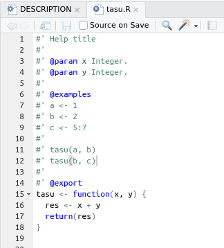

# Rのコード記述

```{r 03_setup, include=FALSE}
knitr::opts_chunk$set(eval = FALSE,
                      echo = TRUE,
                      comment = "#> ",
                      collapse = TRUE,
                      warning = FALSE,
                      message = FALSE)
library(tidyverse)
```


## roxygen2の記法

Rファイル内にドキュメント要素を記述する方法があり、roxygen2を利用すると簡単にできます。RStudioには標準で対応しているので、スムーズに入力できます。

roxygen2の記法については、Rパッケージ開発のチートシートを参照する、もしくはGitHub上にある有名なRパッケージのコードを見るといいでしょう。

## 関数を書く

`R`ディレクトリ内に`*.R`ファイルを準備して関数などを作成してください。例えばこんな感じです:



`@export`は｢この関数はパッケージを読み込めば使えるようにしろ｣という指示なので、忘れないようにしてください

## パッケージ同封データ

## ヘルプファイル作成

`*.R`ファイル内にroxygen2記法で書き込んでいれば、ヘルプファイルを簡単に作成することが可能です。以下の1行を実行してください:

```{r}
devtools::document()
```

これでOKです。

## FAQ

あとで。

## 参考資料

あとで。
