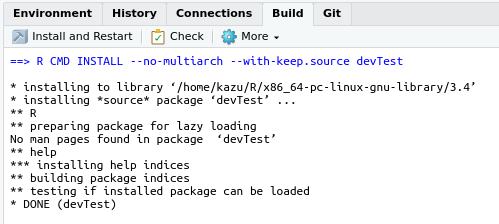
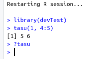
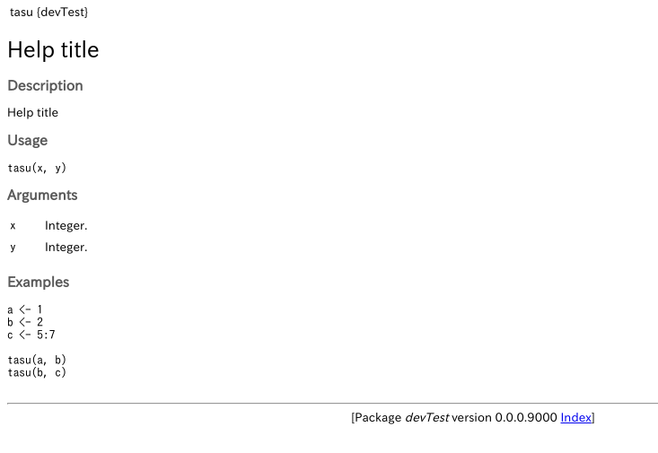

# パッケージのテスト

```{r 04_setup, include=FALSE}
knitr::opts_chunk$set(eval = FALSE,
                      echo = TRUE,
                      comment = "#> ",
                      collapse = TRUE,
                      warning = FALSE,
                      message = FALSE)
library(tidyverse)
```


## testthatによるテスト

testthatでググってください。

## Buildしてからのテスト

パッケージをbuildするには、RStudioの[Build]タブを選択して[Install and Restart]ボタンをクリックしてください:



自動的に(一時的に)そのパッケージが読み込まれるので、実際に関数を実行してテストしてみてください:



ひとつ前の章で、`devtools::documents()`を実行してヘルプファイルを生成しているのなら、この段階でヘルプが見れます:



なお、これでパッケージビルドした内容はRを閉じると消えます。
