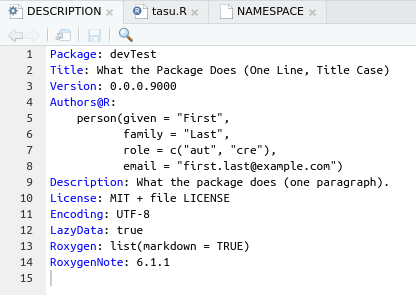
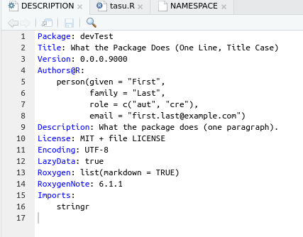
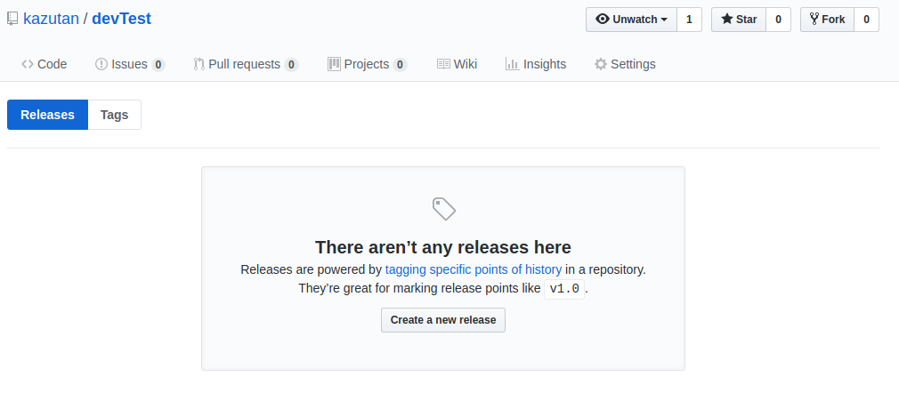

# パッケージの公開とリリース

```{r 05_setup, include=FALSE}
knitr::opts_chunk$set(eval = FALSE,
                      echo = TRUE,
                      comment = "#> ",
                      collapse = TRUE,
                      warning = FALSE,
                      message = FALSE)
library(tidyverse)
```


## githubへのpush

パッケージを作成したら、githubへpushしましょう。基本、これでOKです。

## バージョンとリリース

### `DESCRIPTION`ファイルを編集

パッケージ情報を作成しましょう。これは`DESCRIPTION`ファイルを変更していきます:



なお、パッケージ依存がある場合はこのファイルに書いていく必要があるのですが、これも以下の関数で自動的に入れることができます:

```{r}
usethis::use_package("name_of_package", type = "Imports")
```

これでOKです



次にバージョンですが、これも`DESCRIPTION`ファイルに記入してください。

必要事項を記入したら、githubへpushしてください。


### GitHubでのリリース

GitHubでリリースします。GitHubの該当リポジトリへアクセスし、releaceタブをクリックしてください:



バージョン名をよく確認し、リリースをすれば完了です。
