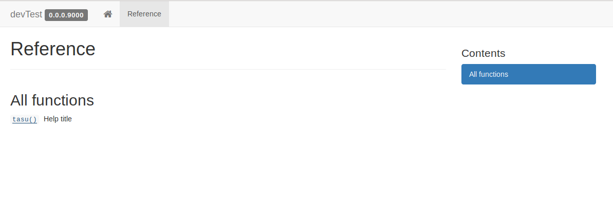

# パッケージ用サイト作成

```{r 06_setup, include=FALSE}
knitr::opts_chunk$set(eval = FALSE,
                      echo = TRUE,
                      comment = "#> ",
                      collapse = TRUE,
                      warning = FALSE,
                      message = FALSE)
library(tidyverse)
```


## パッケージ用サイトの必要性

## pkgdownを利用したサイト作成

1. pkgdownをインストール
2. README.md(or README.Rmd)を準備
3. 以下のコードを実行するだけ


```{r}
pkgdown::build_site()
```

あっという間に完成.



## サイトをGitHubにデプロイ

pkgdownの関数でもいけるけど、今回は使わない方向で説明。

1. `docs/` をgit add -> commit -> push
2. GitHubのリポジトリサイトにアクセスし、[Settings]タブへ移動
3. GitHub Pagesを有効化  
このとき、｢masterブランチのdocsディレクトリにする｣のを選択
4. ブラウザでアクセスしてチェック


